# Object Tracking Benchmark
## Result
### Overall
dlib > mf > boosting > mil > kcf > goturn > tld
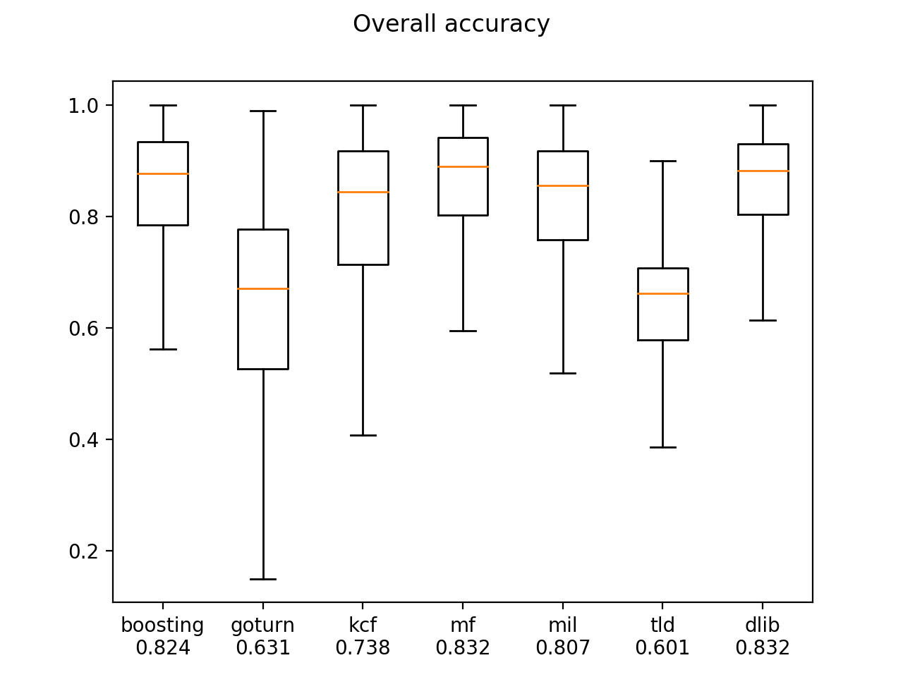
goturn < boosting < dlib < mil < mf < tld < kcf

### IV
Illumination Variation - the illumination in the target region is significantly changed.

dlib > mf > boosting > mil > kcf > goturn > tld

goturn < boosting < dlib < mil < mf < tld < kcf
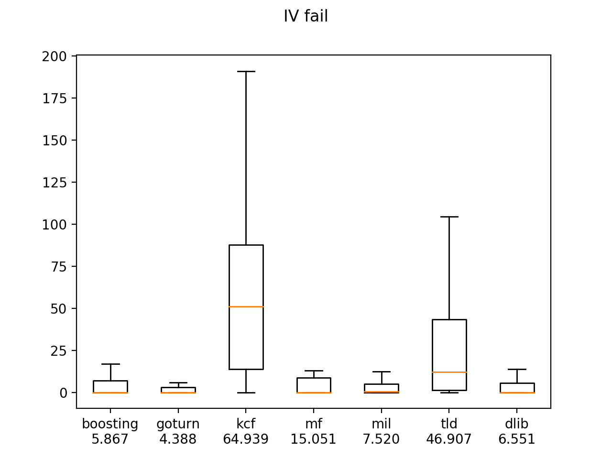
### SV
Scale Variation – the ratio of the bounding boxes of the first frame and the current frame is out of 

dlib > mf > boosting > mil > kcf > goturn > tld
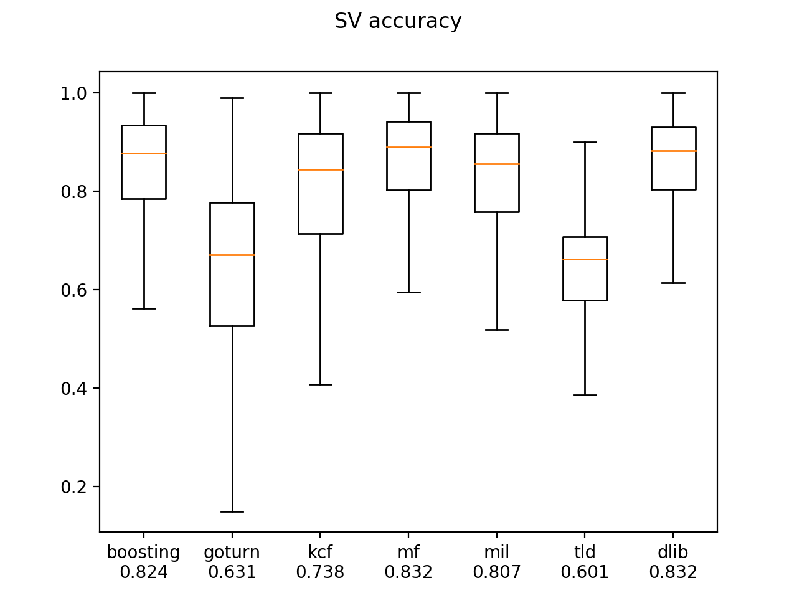
goturn < boosting < dlib < mil < mf < tld < kcf

### OCC
Occlusion – the target is partially or fully occluded.

dlib > mf > boosting > mil > kcf > goturn > tld
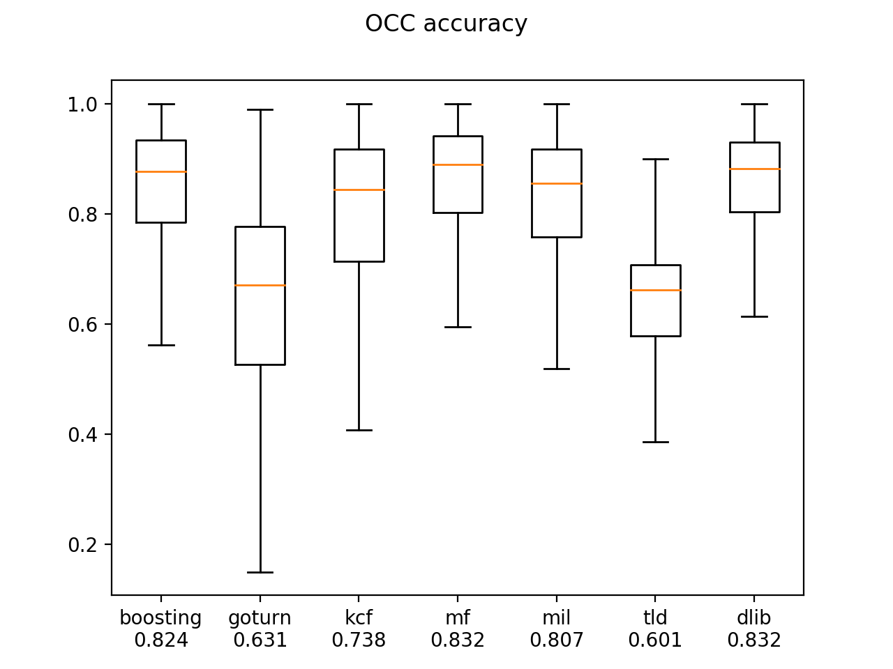
goturn < boosting < dlib < mil < mf < tld < kcf

### DEF
Deformation – non-rigid object deformation.

dlib > mf > boosting > mil > kcf > goturn > tld

goturn < boosting < dlib < mil < mf < tld < kcf
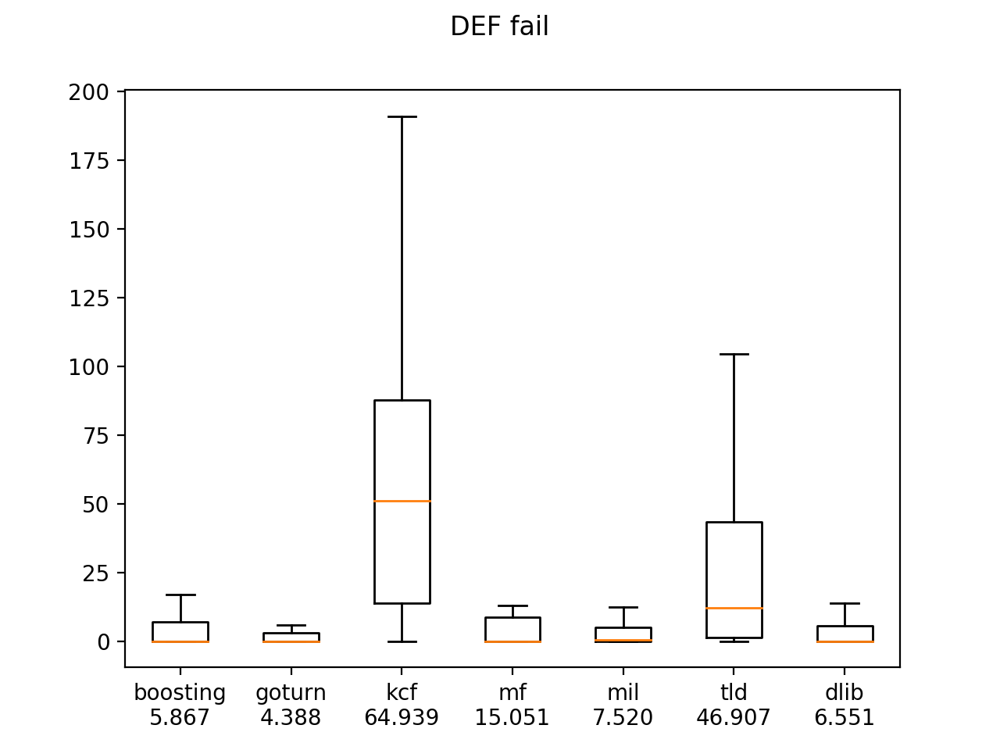
### MB
Motion Blur – the target region is blurred due to the motion of target or camera.

dlib > mf > boosting > mil > kcf > goturn > tld

goturn < boosting < dlib < mil < mf < tld < kcf

### FM
Fast Motion – the motion of the ground truth is larger than tm pixels (tm=20).

dlib > mf > boosting > mil > kcf > goturn > tld
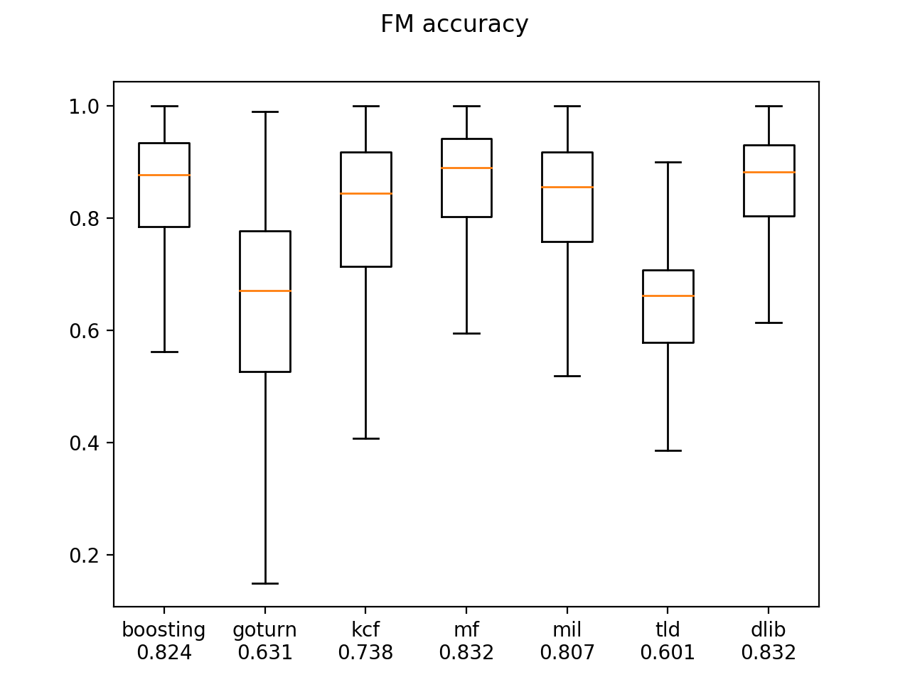
goturn < boosting < dlib < mil < mf < tld < kcf
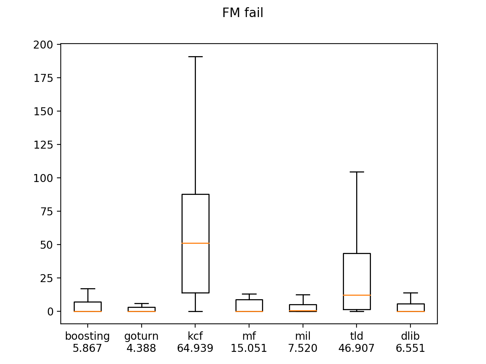
### IPR
In-Plane Rotation – the target rotates in the image plane.

dlib > mf > boosting > mil > kcf > goturn > tld
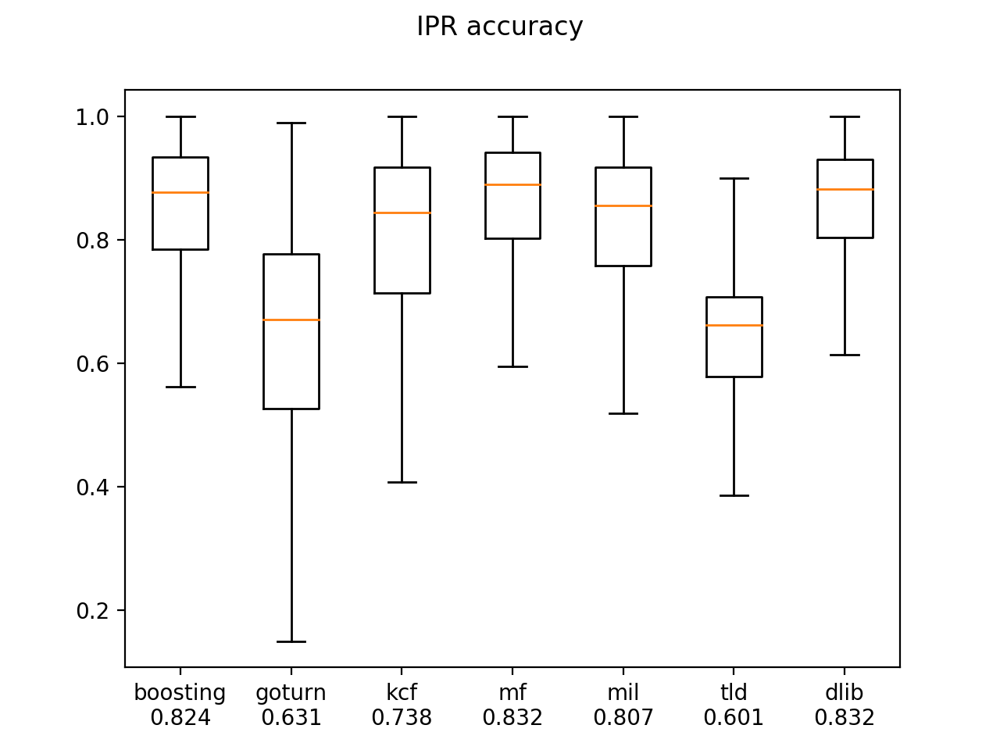
goturn < boosting < dlib < mil < mf < tld < kcf

### OPR
Out-of-Plane Rotation – the target rotates out of the image plane.

dlib > mf > boosting > mil > kcf > goturn > tld
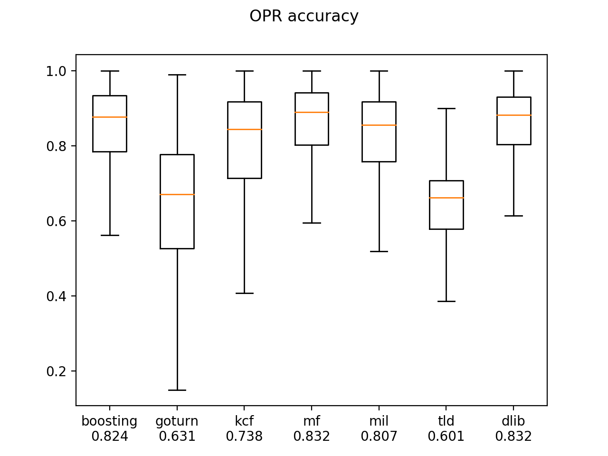
goturn < boosting < dlib < mil < mf < tld < kcf

### OV
Out-of-View – some portion of the target leaves the view.

dlib > mf > boosting > mil > kcf > goturn > tld

goturn < boosting < dlib < mil < mf < tld < kcf
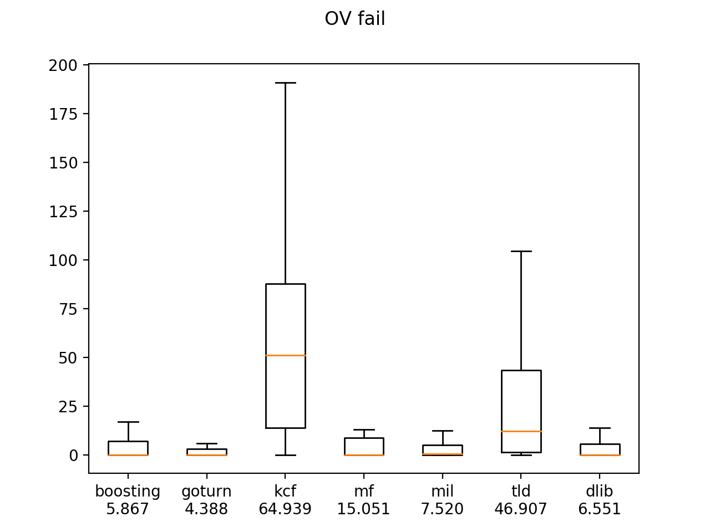
### BC
Background Clutters – the background near the target has the similar color or texture as the target.

dlib > mf > boosting > mil > kcf > goturn > tld
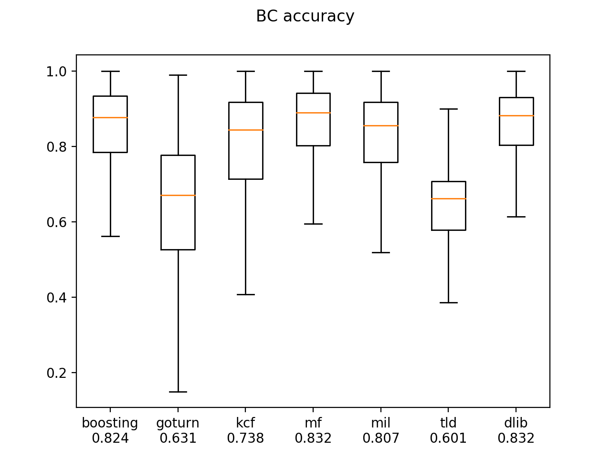
goturn < boosting < dlib < mil < mf < tld < kcf
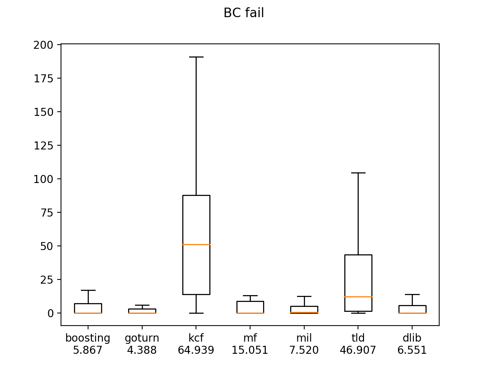
### LR
Low Resolution – the number of pixels inside the ground-truth bounding box is less than tr (tr =400).

dlib > mf > boosting > mil > kcf > goturn > tld

goturn < boosting < dlib < mil < mf < tld < kcf

